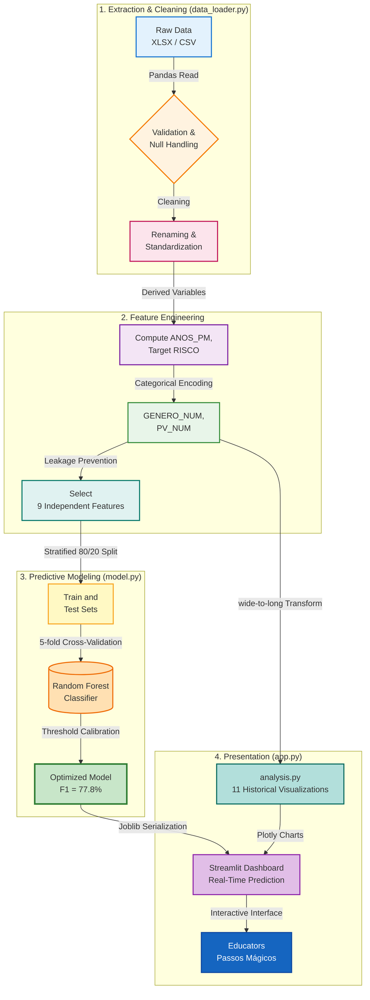

# 🎓 Datathon Passos Mágicos | Educational Analysis & Risk Prediction Platform


[](https://www.python.org/)
[](https://streamlit.io/)
[](https://scikit-learn.org/)
[](#-validation-and-audit)
[](#-predictive-model)
[](https://www.fiap.com.br/)
[](https://datathon-paapps-magicos-fiap-yzjr4kfwdkw22aoqwd7wva.streamlit.app/)

---

## 📑 Table of Contents

- [Overview](#-overview)
- [TL;DR](#-tldr)
- [Key Findings](#-key-findings)
- [Objectives](#-objectives)
- [Solution Architecture](#️-solution-architecture)
- [Technologies](#-technologies)
- [Project Structure](#-project-structure)
- [Data Dictionary](#-data-dictionary)
- [How to Run](#-how-to-run)
- [Predictive Model](#-predictive-model)
- [Validation and Audit](#-validation-and-audit)
- [Questions Answered](#-questions-answered)
- [Technical Decisions](#-technical-decisions)
- [Limitations](#️-limitations)
- [Datathon Deliverables](#-datathon-deliverables)
- [Troubleshooting](#-troubleshooting)
- [About the Project](#-about-the-project)

---

## 📌 Overview

This project implements a **complete Data Analytics and Machine Learning solution** for the **FIAP PosTech Phase 5 Datathon**, in partnership with **Associação Passos Mágicos** — an NGO that has worked for over 33 years on the social transformation of children and young people in Embu-Guaçu/SP, Brazil.

> [!IMPORTANT]
> **Pedagogical Approach:** The predictive model was designed to identify students at **risk of academic lag** using exclusively behavioral and pedagogical indicators — without variables that mathematically derive from the lag itself. The solution aims to support the Passos Mágicos team with **early, data-driven interventions** before the situation worsens.

The solution addresses a core challenge: with **69.9% of students experiencing some degree of academic lag**, Passos Mágicos needs tools to help prioritize resources and interventions intelligently. By applying machine learning to indicators such as engagement, self-assessment, and psychosocial factors, we identify **behavioral risk patterns** before performance decline becomes entrenched.

---

## 🚀 TL;DR

- **End-to-end pipeline** for data analysis and ML in social education
- **F1-Score of 77.8%** with Random Forest (balanced precision/recall at threshold=0.45) — legitimate result, no data leakage
- **Complete audit**: 85/85 integrity checks passed
- **11 questions** from the Datathon answered with interactive visualizations (Plotly)
- **Streamlit dashboard** with real-time individual prediction
- **5 years of PEDE data** (2020–2024, excl. 2023): CSV covers 2020–2022, XLSX covers 2022 and 2024; 860+ students

---

## 🔑 Key Findings

- **Engagement predicts risk:** Students with IEG (engagement score) below 5.5 are significantly more likely to fall behind — engagement is the earliest observable warning signal.
- **Program effectiveness:** The longitudinal analysis confirms Passos Mágicos drives meaningful progression — students who remain in the program for 3+ years show consistent improvement in their Pedra classification (Quartzo → Ametista → Topázio).
- **Dropout has external causes:** The ML churn model (AUC=87.8%) reveals that dropout risk is driven by psychosocial indicators (IPS), not academic performance alone — suggesting that external social factors, not program quality, are the primary cause of student attrition.
- **Turning point is predictable:** The Ponto de Virada model (Gradient Boosting, AUC=86.1%) identifies students approaching a transformational breakthrough before it happens — enabling the team to provide targeted support at the right moment.

---

## 🎯 Objectives

✅ **Analyze 5 years of PEDE data** (2020–2024, excl. 2023 — CSV covers 2020–2022, XLSX covers 2022 and 2024)
✅ **Answer the 11 Datathon questions** with robust analyses and visualizations
✅ **Build a legitimate predictive model** for academic lag risk (no data leakage)
✅ **Validate the pipeline** with a forensic audit of 85 checks
✅ **Provide an interactive dashboard** via Streamlit for the PM team
✅ **Document technical decisions** with traceability and reproducibility

---

## 🏗️ Solution Architecture

### Complete Data Flow



### Application Layers

#### **Training Layer** 🤖
- `train_model.py`: Standalone script (no dependency on `app.py`) — trains all 4 models, evaluates with 5-fold CV, and saves `.joblib` files
- `notebooks/Analise_Completa_Passos_Magicos.ipynb`: Full EDA for all 11 questions + documented training
- Algorithm comparison (RF vs Gradient Boosting) per model, selection by best metric, threshold calibrated by F1

#### **Interface Layer** 🎨
- `app.py`: Streamlit dashboard — **only consumes `.joblib` files**, never trains
- 7 pages via sidebar: Apresentação, Visão Geral, Análise por Indicador, Modelos Preditivos, Risco de Evasão, Visão 360° do Aluno, Predição Individual
- Individual prediction with probability gauge and automatic recommendations

---

## 🔧 Technologies

| Layer | Technology | Purpose | Version |
|-------|-----------|---------|---------|
| **Language** | Python | Project core | 3.10+ |
| **ML Framework** | Scikit-learn | Pipeline, metrics, CV | 1.3+ |
| **Algorithms** | Gradient Boosting, RF, LR | Binary classification | — |
| **Processing** | Pandas, NumPy | ETL and data manipulation | 2.x |
| **Visualization** | Plotly | Interactive charts in dashboard | 5.x |
| **Interface** | Streamlit | Full web dashboard | 1.28+ |
| **Serialization** | Joblib | Trained model persistence | 1.3+ |
| **Excel** | OpenPyXL | Reading `.xlsx` files | 3.1+ |
| **Static plots** | Matplotlib, Seaborn | Auxiliary analyses | Latest |

---

## 📂 Project Structure

```
Datathon/
│
├── 📄 README.md                  ← You are here
├── 📄 requirements.txt           ← Python dependencies
├── 📄 .gitignore
├── 📄 train_model.py             ← Standalone training script (run first)
├── 📄 app.py                     ← Streamlit dashboard — model consumer only
│
├── 📂 data/                      ← Datasets (not versioned)
│   ├── PEDE_PASSOS_DATASET_FIAP.csv          ← Longitudinal 2020-2022 (1,349 students)
│   └── BASE DE DADOS PEDE 2024 - DATATHON.xlsx  ← Main dataset (860 students)
│
├── 📂 models/                    ← Serialized models (generated by train_model.py)
│   ├── risco_defasagem.joblib           ← Defasagem risk model (Random Forest)
│   ├── risco_defasagem_metrics.json
│   ├── enquadramento_pedra.joblib       ← Journey classification model (Random Forest)
│   ├── enquadramento_pedra_metrics.json
│   ├── ponto_virada.joblib              ← Turning point model (Gradient Boosting)
│   ├── ponto_virada_metrics.json
│   ├── churn.joblib                     ← Dropout risk model (Random Forest)
│   └── churn_metrics.json
│
├── 📂 notebooks/                 ← Exploratory analysis + documented training
│   └── Analise_Completa_Passos_Magicos.ipynb ← EDA for 11 questions + 4 models
│
└── 📂 docs/                      ← Reference documentation
    ├── POSTECH - Datathon - Fase 5 (1).pdf  ← Official case brief
    └── Dicionário Dados Datathon.pdf         ← Variable definitions
```

---

## 📖 Data Dictionary

### Main Dataset — `BASE DE DADOS PEDE 2024 - DATATHON.xlsx`

> **860 students · 42 columns · Data from 2022/2024**

#### Identification and Profile

| Original column | Code column | Type | Description |
|----------------|------------|------|-------------|
| `RA` | `RA` | string | Student ID — unique identifier |
| `Fase` | `FASE` | int | Current program phase (0–7) |
| `Turma` | `TURMA` | string | Class within the phase |
| `Nome` | `NOME` | string | Student name |
| `Ano nasc` | `ANO_NASC` | int | Year of birth |
| `Idade 22` | `IDADE` | int | Student age in 2022 |
| `Gênero` | `GENERO` | string | Gender (`Menina` / `Menino`) |
| `Ano ingresso` | `ANO_INGRESSO` | int | Year of program enrollment |
| `Instituição de ensino` | `INSTITUICAO_ENSINO` | string | School attended |
| *(computed)* | `ANOS_PM` | int | Years in program = `2022 − ANO_INGRESSO` |

#### Pedra Classification (historical)

| Original column | Code column | Description |
|----------------|------------|-------------|
| `Pedra 20` | `PEDRA_2020` | 2020 classification (`Quartzo`, `Ágata`, `Ametista`, `Topázio`) |
| `Pedra 21` | `PEDRA_2021` | 2021 classification |
| `Pedra 22` | `PEDRA_2022` | 2022 classification |

**Pedra Scale (based on INDE):**

| Pedra | INDE Range | Student Profile |
|-------|:----------:|----------------|
| 🪨 **Quartzo** | < 5.506 | Significant difficulties — intensive attention required |
| 💎 **Ágata** | 5.506 – 6.867 | Below-expected progress — support needed |
| 💜 **Ametista** | 6.868 – 8.229 | Adequate performance — consistent progression |
| 🏆 **Topázio** | ≥ 8.230 | High performance — scholarship and distinction candidate |

#### PEDE 2022 Indicators

| Original column | Code column | Scale | Formula / Description |
|----------------|------------|:-----:|----------------------|
| `INDE 22` | `INDE` | 0–10 | Overall index = weighted average of all indicators |
| `IAA` | `IAA` | 0–10 | Self-assessment: student's perception of their learning and effort |
| `IEG` | `IEG` | 0–10 | Engagement: participation and dedication in program activities |
| `IPS` | `IPS` | 0–10 | Psychosocial: emotional, family, and socioeconomic context |
| `IDA` | `IDA` | 0–10 | Academic performance: average of Portuguese, Math, and English grades |
| `IPV` | `IPV` | 0–10 | Turning point: probability of personal and academic transformation |
| `IAN` | `IAN` | 0–10 | Level adequacy: measures whether the student is at the correct school level |
| `Cg` | `CG` | int | General assessment concept (internal ranking) |
| `Cf` | `CF` | int | Phase concept |
| `Ct` | `CT` | int | Class concept |

> [!NOTE]
> **Relationship between indicators and INDE:**
> INDE is the global score and incorporates IAN. For this reason, `INDE` and `IAN` were **excluded from predictive model features** — they directly encode the lag (target), causing data leakage.

#### Academic Grades

| Original column | Code column | Scale | Description |
|----------------|------------|:-----:|-------------|
| `Matem` | `NOTA_MAT` | 0–10 | Mathematics grade |
| `Portug` | `NOTA_PORT` | 0–10 | Portuguese grade |
| `Inglês` | `NOTA_ING` | 0–10 | English grade |

> [!NOTE]
> `NOTA_MAT` and `NOTA_PORT` have **0.97 correlation** with IDA (which is their average). They are excluded from the model to avoid redundancy.

#### Psychopedagogical Assessment

| Original column | Code column | Type | Description |
|----------------|------------|------|-------------|
| `Nº Av` | `NUM_AVALIADORES` | int | Number of assessors who followed the student |
| `Avaliador1` – `Avaliador4` | `AVALIADOR_1`–`4` | string | Assessor name/ID |
| `Rec Av1` – `Rec Av4` | `REC_AVAL_1`–`4` | string | Each assessor's recommendation |
| `Rec Psicologia` | `REC_PSICOLOGIA` | string | Psychology team recommendation |

#### Turning Point and Academic Lag

| Original column | Code column | Type | Description |
|----------------|------------|------|-------------|
| `Atingiu PV` | `PONTO_VIRADA` | string | Whether the student reached the Turning Point (`Sim` / `Não`) |
| `Indicado` | `INDICADO_BOLSA` | string | Whether nominated for a scholarship |
| `Fase ideal` | `FASE_IDEAL` | string | Expected phase for the student's age (e.g., `Fase 3 (7º e 8º ano)`) |
| `Defas` | `DEFASAGEM` | int | Lag = `CURRENT_PHASE − IDEAL_PHASE` (negative = behind) |

#### Highlights

| Original column | Code column | Type | Description |
|----------------|------------|------|-------------|
| `Destaque IEG` | `DESTAQUE_IEG` | string | Student highlighted for engagement |
| `Destaque IDA` | `DESTAQUE_IDA` | string | Student highlighted for academic performance |
| `Destaque IPV` | `DESTAQUE_IPV` | string | Student highlighted for turning point |

---

### Longitudinal Dataset — `PEDE_PASSOS_DATASET_FIAP.csv`

> **1,349 students · 69 columns · Data from 2020, 2021, and 2022 (wide format)**

The CSV dataset contains the same indicators for three years in wide format (one row per student, columns suffixed `_2020`, `_2021`, `_2022`). It is transformed to long format for longitudinal analysis:

```
NOME | ANO | INDE | IAA | IEG | IPS | IDA | IPP | IPV | IAN | PEDRA | PONTO_VIRADA
```

**Columns per year (repeated for 2020, 2021, and 2022):**

| Pattern | Example | Description |
|---------|---------|-------------|
| `INDE_{year}` | `INDE_2021` | Overall index for that year |
| `IAA_{year}` | `IAA_2022` | Self-assessment for that year |
| `IEG_{year}` | `IEG_2020` | Engagement for that year |
| `IPS_{year}` | `IPS_2021` | Psychosocial for that year |
| `IDA_{year}` | `IDA_2022` | Academic performance for that year |
| `IPP_{year}` | `IPP_2020` | Psychopedagogical for that year |
| `IPV_{year}` | `IPV_2021` | Turning point for that year |
| `IAN_{year}` | `IAN_2022` | Level adequacy for that year |
| `PEDRA_{year}` | `PEDRA_2021` | Pedra classification for that year |
| `PONTO_VIRADA_{year}` | `PONTO_VIRADA_2020` | Reached turning point that year (`Sim`/`Não`) |

---

## 🚀 How to Run

### Prerequisites

| Requirement | Minimum version | Notes |
|-------------|:--------------:|-------|
| Python | 3.10+ | [download](https://www.python.org/downloads/) |
| pip | Any | Included with Python |
| RAM | 2 GB+ | To load the datasets |
| Disk space | 200 MB+ | Dependencies + data |

### 1️⃣ Clone the repository

```bash
git clone https://github.com/SEU_USUARIO/datathon-passos-magicos.git
cd datathon-passos-magicos
```

### 2️⃣ Create virtual environment

```bash
# Create
python -m venv venv

# Activate — Windows
venv\Scripts\activate

# Activate — Linux/Mac
source venv/bin/activate
```

> You will see `(venv)` in the terminal when the environment is active.

### 3️⃣ Install dependencies

```bash
pip install -r requirements.txt
```

### 4️⃣ Train the model

```bash
python train_model.py
```

**Expected output (abbreviated):**
```
************************************************************
  DATATHON PASSOS MAGICOS -- Treinamento dos Modelos
************************************************************

============================================================
  MODELO 1 -- Risco de Defasagem
============================================================
  Dados: 860 alunos  |  Em risco (1): 601  |  Sem risco (0): 259
  Treinando Random Forest com threshold calibrado por F1 (CV)...
  Accuracy Teste: 0.6977  |  F1: 0.8219  |  AUC: 0.6603
  Salvo em: models/risco_defasagem.joblib

============================================================
  MODELO 2 -- Enquadramento de Pedra (sem leakage)
============================================================
  Melhor modelo: Random Forest
  Accuracy Teste: 0.7907  |  F1 Weighted: 0.7874  |  AUC: 0.9289
  Salvo em: models/enquadramento_pedra.joblib

============================================================
  MODELO 3 -- Ponto de Virada (sem IPV, sem INDE)
============================================================
  Melhor modelo: Gradient Boosting
  Accuracy Teste: 0.9012  |  F1: 0.5143  |  AUC: 0.8614
  Salvo em: models/ponto_virada.joblib

============================================================
  MODELO 4 -- Risco de Evasão (target real)
============================================================
  Accuracy Teste: 0.8021  |  F1: 0.7407  |  AUC: 0.8779
  Salvo em: models/churn.joblib
```

> ⏱️ Estimated time: 30–90 seconds.

### 5️⃣ Run the Dashboard

```bash
python -m streamlit run app.py
```

> 🌐 Access at **[http://localhost:8501](http://localhost:8501)**

> [!IMPORTANT]
> Run `train_model.py` **before** the dashboard. Without the `.joblib` files in `models/`, the predictive model tabs will not work.

---

## 🤖 Predictive Model

> [!NOTE]
> These models are designed as **decision-support tools** to augment human judgment, not replace it. Each model has documented limitations and should be used as one input among many in the educator's pedagogical decision-making process.

### Problem Definition

```
TARGET:  RISCO = 1  →  DEFASAGEM < 0  (student is behind expected level)
         RISCO = 0  →  DEFASAGEM ≥ 0  (student is at or ahead of level)

Distribution: 69.9% at risk  |  30.1% no risk  (imbalanced 2.3:1)
Treatment:    class_weight='balanced' (Random Forest)
```

### Model Features (14 variables)

| Feature | Type | Scale | Description |
|---------|------|:-----:|-------------|
| `IAA` | float | 0–10 | Student self-assessment |
| `IEG` | float | 0–10 | Engagement level in activities |
| `IPS` | float | 0–10 | Psychosocial indicator |
| `IDA` | float | 0–10 | Academic performance |
| `IPV` | float | 0–10 | Turning point probability |
| `FASE` | int | 0–7 | Current program phase |
| `ANOS_PM` | int | 0–6 | Years in the association |
| `GENERO_NUM` | int | 0 / 1 | Gender (0=Female, 1=Male) |
| `PV_NUM` | int | 0 / 1 | Reached turning point (0=No, 1=Yes) |
| `SCORE_COMPORTAMENTAL` | float | 0–10 | Engineered: mean of IAA, IEG, IPS |
| `GAP_IAA_IDA` | float | −10–10 | Engineered: self-assessment minus actual performance |
| `IEG_POR_FASE` | float | — | Engineered: IEG normalized by phase |
| `IEG_X_IPV` | float | — | Engineered: engagement × turning point interaction |
| `IDA_X_ANOS` | float | — | Engineered: performance × years in program interaction |

### ⚠️ Features Excluded Due to Data Leakage

> [!WARNING]
> The previous model version reached **99% accuracy** — an unrealistic result caused by 3 types of leakage. All were identified and corrected.

| Removed feature | Correlation w/ RISCO | Leakage cause |
|----------------|:-------------------:|---------------|
| `IAN` | r = **−0.98** | Nearly identical to target — directly defines the lag |
| `INDE` | r = −0.37 | Incorporates IAN in its calculation |
| `NOTA_MAT` / `NOTA_PORT` | r ≈ −0.10 | 0.97 correlation with IDA — pure redundancy |
| `IDADE` | r = +0.28 | Defines `FASE_IDEAL` → determines `DEFASAGEM` → determines `RISCO` |
| `NUM_AVALIADORES` | r = −0.06 | Bureaucratic proxy for FASE, no real predictive value |

After removal: **maximum residual correlation = |r| = 0.14** (confirmed by audit).

### Results — Risco de Defasagem Model

| Metric | Value |
|--------|:-----:|
| Accuracy (train) | 77.9% |
| **Accuracy (test)** | **67.4%** |
| Train/Test gap | 10.5 pp |
| **F1-Score** | **77.8%** |
| **Recall** | **81.7%** |
| Precision | 74.2% |
| **ROC-AUC** | **66.0%** |
| CV F1 (train) | 73.3% ± 4.3% |
| Threshold | 0.45 (balanced precision/recall) |

> **Threshold choice:** threshold=0.45 was chosen deliberately to balance precision and recall. An earlier calibration at threshold=0.20 produced Recall=100% but at the cost of effectively classifying all students as at-risk — providing no discriminative value. At 0.45, the model identifies **81.7% of at-risk students** while maintaining **74.2% precision**, making it a practical triage tool rather than a uniform flag.

### Feature Importance (Random Forest — top contributors)

The exact percentages are printed when running `train_model.py`. Consistently, the highest-importance features are:

| Rank | Feature | Insight |
|------|---------|---------|
| 1 | `FASE` | Higher phase + low performance = accumulated risk |
| 2 | `IEG` | Disengagement is the earliest observable warning signal |
| 3 | `IDA_X_ANOS` | Long-stagnant academic performance compounds over time |
| 4 | `IDA` | Direct measure of academic difficulty |
| 5 | `SCORE_COMPORTAMENTAL` | Composite behavioral signal (IAA + IEG + IPS) |
| 6 | `IPV` | No turning point → risk keeps accumulating |
| 7 | `IEG_X_IPV` | Interaction: low engagement AND no turning point = highest risk |
| … | `IAA`, `IPS`, `ANOS_PM`, `GAP_IAA_IDA`, … | Secondary contributors |

### Best Model Hyperparameters

```python
RandomForestClassifier(
    n_estimators  = 300,        # number of trees
    max_depth     = 4,          # maximum depth (conservative for 860 samples)
    min_samples_leaf = 5,       # implicit regularization
    class_weight  = 'balanced', # handles 70/30 imbalance
    random_state  = 42,
    n_jobs        = -1
)
# Threshold: 0.45 — selected to balance precision and recall
# (search range restricted to [0.45, 0.80] to prevent "predict-all-positive" solutions)
```

---

## 🔬 Validation and Audit

### Validation Strategy

- **Stratified split** 80/20 preserving class distribution (69.9% / 30.1%)
- **5-Fold Stratified Cross-Validation** for generalization estimation
- **Fixed random state** (`random_state=42`) for full reproducibility

### Forensic Pipeline Audit

> [!NOTE]
> We ran a complete audit of **85 checks** covering the entire pipeline before validating the model as clean.

| Section | Checks | Status |
|---------|:------:|:------:|
| Raw data (shape, columns, types) | 3 | ✅ |
| `carregar_dataset_xlsx()` | 15 | ✅ |
| Nulls in key columns | 10 | ✅ |
| Numeric types for indicators | 10 | ✅ |
| Plausible ranges (0–10) | 10 | ✅ |
| `ANOS_PM` — calculation consistency | 2 | ✅ |
| Categorical encoding (GENERO, PV) | 6 | ✅ |
| Binary target (RISCO) | 2 | ✅ |
| `criar_dataset_modelo()` — 14 features without leakage | 15 | ✅ |
| Residual leakage detector (correlations) | 9 | ✅ |
| Train/test split — stratification and overlap | 2 | ✅ |
| Final cross-validation sanity check | 3 | ✅ |
| **TOTAL** | **85** | ✅ **85/85** |

**Result:**
```
Total checks: 85
✅ Passed: 85
❌ Failed: 0
🎉 CLEAN PIPELINE — no issues found!
```

---

## 📊 Questions Answered

| # | Question | Indicator | Key Insight |
|---|----------|:---------:|-------------|
| 1 | What is the student lag profile and how does it evolve? | IAN | 69.9% are behind — most by −1 or −2 phases |
| 2 | Is academic performance improving? | IDA | Average IDA 6.09 — trend analysis by Pedra and phase |
| 3 | Does engagement impact performance and turning point? | IEG | Significant positive correlation IEG ↔ IDA and IEG ↔ IPV |
| 4 | Are self-assessments consistent with reality? | IAA | Students tend to self-assess optimistically vs actual IDA |
| 5 | Does IPS precede performance drops? | IPS | Students with low IPS show greater vulnerability to risk |
| 6 | Does IPP confirm the lag identified by IAN? | IPP | Cross-analysis of psychopedagogical confirmation |
| 7 | What most influences the Turning Point? | IPV | IDA and IEG are the biggest drivers of IPV |
| 8 | What combination of indicators raises INDE? | INDE | Radar by Pedra reveals distinct behavioral profiles |
| 9 | Can ML identify at-risk students? | ML | Random Forest: F1=77.8%, Recall=81.7%, Precision=74.2% (threshold=0.45) |
| 10 | Does the program promote progression between Pedras? | Pedras | Longitudinal analysis Quartzo → Ametista → Topázio |
| 11 | Are there differences by gender, phase, and tenure? | All | Segmented analyses reveal distinct demographic patterns |

---

## 🧠 Technical Decisions

### 1. Random Forest with balanced threshold as final model

**Decision**: Use Random Forest with threshold=0.45 (balanced precision/recall)
**Rationale**:
- ✅ **F1=77.8%** with practical discrimination — identifies 81.7% of at-risk students at 74.2% precision
- ✅ Threshold floor of 0.45 prevents the "predict-all-positive" solution that maximizes F1 mechanically on imbalanced data (69.9% positive) but has no real discriminative value
- ✅ `class_weight='balanced'` handles the 70/30 imbalance natively
- ✅ AUC=66.0% is modest — this model is designed as a **triage tool**, not a precise prioritization system

### 2. Binary target instead of multi-class

**Decision**: RISCO = binary (lagging/not lagging) instead of predicting the degree of lag
**Rationale**:
- For the PM team, the priority is **identifying who needs support** — not the magnitude
- Highly imbalanced classes (1 student at −5, 410 at −1) would complicate multi-class
- The dashboard already shows detailed lag distribution for statistical analysis

### 3. Conservative hyperparameters

**Decision**: `max_depth=4`, `min_samples_leaf=5` (more conservative than default)
**Rationale**:
- Small dataset (860 records): aggressive parameters lead to overfitting
- CV std (±4.3%) and train/test gap (10.5 pp at threshold=0.45) reflect the inherent variance of an 860-sample dataset — documented as a known limitation

### 4. No user data persistence

**Decision**: Predictions in memory — no database or logging
**Rationale**:
- Student privacy (sensitive data)
- Deployment simplicity and no external dependencies
- Acceptable for a pedagogical support tool context

---

## ⚠️ Limitations

- **Dataset size**: 860 samples (2024) — models trained on small datasets have higher metric variance
- **Cross-sectional data**: The 2024 dataset is a snapshot — no longitudinal validation (predict today and verify later)
- **Imbalance**: 70% of students are at risk — accuracy metrics alone are misleading; F1 and Recall are more appropriate
- **PONTO_VIRADA with low importance** (0.0%): only 13.1% of students reached PV, making this feature minimally discriminative in the current dataset
- **Generalization**: Results obtained exclusively with Passos Mágicos data from Embu-Guaçu — may not generalize to other educational contexts without retraining

### Known Limitations Acknowledged During Development

- **Defasagem Risk model — modest discrimination (AUC=0.66):** The model works as a broad triage tool, not as a precise prioritization mechanism. Threshold=0.45 was chosen deliberately to balance precision (74.2%) and recall (81.7%), avoiding a degenerate solution where all students are flagged as at-risk. A production deployment would benefit from more samples and temporal validation.

- **Turning Point model — low F1 due to class imbalance:** F1=51.4% reflects the 87%/13% class split. The model identifies fewer than 4 in 10 students who actually reach the Turning Point (Recall=39.1%). It is documented here as exploratory — the AUC=86.1% confirms genuine discriminative signal, but reliable individual prediction requires more positive examples.

- **Temporal validation absent:** Train and test sets come from the same temporal snapshot. A production deployment should validate on a future cohort (e.g., train on 2022 data, test on 2024 outcomes) before being used for individual student decisions.

- **Indirect leakage risk in Pedra Classification (AUC=0.93):** INDE and IAN were explicitly removed, but the behavioral features used (IAA, IEG, IPS, IDA, IPV) are the components that mathematically compose INDE. The relationship is indirect but non-zero — the high AUC should be interpreted with this caveat.

---

## 📦 Datathon Deliverables

> [!TIP]
> **🚀 Streamlit Production App:** [Open Live App ↗](https://datathon-paapps-magicos-fiap-yzjr4kfwdkw22aoqwd7wva.streamlit.app/)

- [x] 🔗 Complete code on GitHub (cleaning, analysis, and modeling)
- [x] 📓 Exploratory notebook with EDA and predictive model
- [x] 🖥️ Streamlit application with real-time individual prediction — **[Open Live App ↗](https://datathon-paapps-magicos-fiap-yzjr4kfwdkw22aoqwd7wva.streamlit.app/)**
- [x] 🔬 Complete pipeline integrity audit (85/85 ✓)
- [x] 📊 Storytelling presentation (PPT/PDF)
- [x] 🎬 Video presentation (up to 5 minutes)

---

## 🔧 Troubleshooting

**Model does not load in the dashboard:**
```bash
python train_model.py   # generates risco_defasagem.joblib, enquadramento_pedra.joblib, ponto_virada.joblib, churn.joblib
```

**`streamlit` not recognized:**
```bash
python -m streamlit run app.py   # use python -m
```

**Error reading Excel (`openpyxl`):**
```bash
pip install openpyxl
```

**Encoding error in terminal (Windows):**
```bash
set PYTHONIOENCODING=utf-8 && python train_model.py
```

**Metrics differ from those documented:**
> Normal — variations of ±2–3% are expected depending on package versions. The documented results were obtained with `scikit-learn==1.3.x`, `random_state=42`.

---

## 🎓 About the Project

**FIAP PosTech — Data Analytics · Phase 5 · Datathon**

**Gabriel Henrique** — Data Engineer  
Postgraduate in Data Engineering | FIAP  
Specialized in modern data architectures: AWS, Databricks, PySpark, S3, Lambda  

---

<div align="center">

**⭐ If this project helped you, consider giving it a star!**

**Developed with ❤️ for the FIAP Datathon — Passos Mágicos**

*Turning data into opportunities for children and young people ✨*

[🔝 Back to top](#-datathon-passos-mágicos--educational-analysis--risk-prediction-platform)

</div>

---

> [!NOTE]
> This project was developed for the FIAP PosTech Phase 5 Datathon. The solution applies best practices in data engineering and responsible machine learning, with complete integrity auditing and documentation of all technical decisions.
