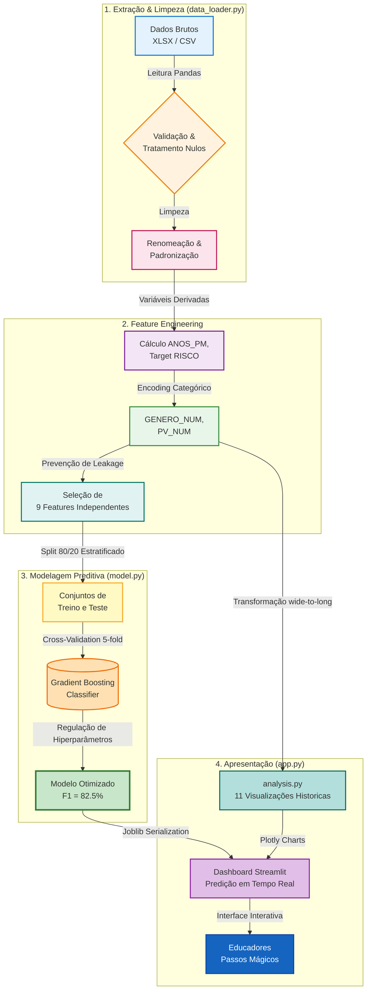

# 🎓 Datathon Passos Mágicos | Plataforma de Análise Educacional & Predição de Risco


[](https://www.python.org/)
[](https://streamlit.io/)
[](https://scikit-learn.org/)
[](https://xgboost.readthedocs.io/)
[](#-validação-e-auditoria)
[](#-modelo-preditivo)
[](https://www.fiap.com.br/)

---

## 📑 Índice

- [Visão Geral](#-visão-geral)
- [TL;DR](#-tldr)
- [Objetivos](#-objetivos)
- [Arquitetura da Solução](#️-arquitetura-da-solução)
- [Tecnologias](#-tecnologias)
- [Estrutura do Projeto](#-estrutura-do-projeto)
- [Dicionário de Dados](#-dicionário-de-dados)
- [Como Executar](#-como-executar)
- [Modelo Preditivo](#-modelo-preditivo)
- [Validação e Auditoria](#-validação-e-auditoria)
- [Perguntas Respondidas](#-perguntas-respondidas)
- [Decisões Técnicas](#-decisões-técnicas)
- [Limitações](#️-limitações)
- [Entregas do Datathon](#-entregas-do-datathon)
- [Troubleshooting](#-troubleshooting)
- [Sobre o Projeto](#-sobre-o-projeto)

---

## 📌 Visão Geral

Este projeto implementa uma **solução completa de Data Analytics e Machine Learning** para o **Datathon FIAP PosTech Fase 5**, em parceria com a **Associação Passos Mágicos** — ONG que atua há mais de 35 anos na transformação social de crianças e jovens em Embu-Guaçu/SP.

> [!IMPORTANT]
> **Abordagem Pedagógica:** O modelo preditivo foi projetado para identificar alunos em **risco de defasagem escolar** usando exclusivamente indicadores comportamentais e pedagógicos — sem variáveis que derivem matematicamente da defasagem. A solução visa apoiar a equipe da Passos Mágicos com **intervenções precoces e baseadas em dados**, antes que a situação se agrave.

A solução responde a um desafio central: com **69.9% dos alunos em algum grau de defasagem**, a Passos Mágicos precisa de ferramentas que ajudem a priorizar recursos e intervenções de forma inteligente. Ao aplicar machine learning sobre indicadores como engajamento, autoavaliação e aspectos psicossociais, conseguimos identificar **padrões comportamentais de risco** antes que a queda de desempenho se consolide.

---

## 🚀 TL;DR

- **Pipeline end-to-end** de análise de dados e ML para educação social
- **F1-Score de 82.5%** com Gradient Boosting — resultado legítimo, sem data leakage
- **Auditoria completa**: 85/85 verificações de integridade passaram
- **11 perguntas** do Datathon respondidas com visualizações interativas (Plotly)
- **Dashboard Streamlit** com predição individual em tempo real
- **4 anos de dados** analisados (PEDE 2020–2024), 860+ alunos

---

## 🎯 Objetivos

✅ **Analisar 4 anos de indicadores PEDE** (2020, 2021, 2022 e 2024)
✅ **Responder as 11 perguntas** do Datathon com análises e visualizações robustas
✅ **Construir modelo preditivo legítimo** de risco de defasagem (sem data leakage)
✅ **Validar o pipeline** com auditoria forense de 85 verificações
✅ **Disponibilizar dashboard interativo** via Streamlit para a equipe da PM
✅ **Documentar decisões técnicas** com rastreabilidade e reprodutibilidade

---

## 🏗️ Arquitetura da Solução

### Fluxo Completo de Dados



### Camadas da Aplicação

#### **Camada de Treinamento** 🤖
- `train_model.py`: Script autônomo (sem dependências de `app.py`) — treina os 3 modelos, avalia com CV 5-fold e salva `.joblib`
- `notebooks/Analise_Completa_Passos_Magicos.ipynb`: EDA completa das 11 perguntas + treinamento documentado
- Comparação de 5 algoritmos, seleção por **F1-Score**, threshold calibrado por F1

#### **Camada de Interface** 🎨
- `app.py`: Dashboard Streamlit — **apenas consome os `.joblib`**, nunca treina
- 7 tabs: Visão Geral, Indicadores (8 sub-análises), Modelo Preditivo, Melhor Matéria, Churn, Alerta Acadêmico, Resultados & Insights
- Predição individual com gauge de probabilidade e recomendações automáticas

---

## 🔧 Tecnologias

| Camada | Tecnologia | Finalidade | Versão |
|--------|-----------|-----------|--------|
| **Linguagem** | Python | Core do projeto | 3.10+ |
| **ML Framework** | Scikit-learn | Pipeline, métricas, CV | 1.3+ |
| **Algoritmos** | Gradient Boosting, RF, XGBoost, LR | Classificação binária | — |
| **Processamento** | Pandas, NumPy | ETL e manipulação de dados | 2.x |
| **Visualização** | Plotly | Gráficos interativos no dashboard | 5.x |
| **Interface** | Streamlit | Dashboard web completo | 1.28+ |
| **Serialização** | Joblib | Persistência do modelo treinado | 1.3+ |
| **Excel** | OpenPyXL | Leitura dos arquivos `.xlsx` | 3.1+ |
| **Plots estáticos** | Matplotlib, Seaborn | Análises auxiliares | Latest |

---

## 📂 Estrutura do Projeto

```
Datathon/
│
├── 📄 README.md                  ← Você está aqui
├── 📄 requirements.txt           ← Dependências Python
├── 📄 .gitignore
├── 📄 train_model.py             ← Script de treinamento autônomo (executar primeiro)
├── 📄 app.py                     ← Dashboard Streamlit — apenas consumidor de modelos
│
├── 📂 data/                      ← Datasets (não versionados)
│   ├── PEDE_PASSOS_DATASET_FIAP.csv          ← Longitudinal 2020-2022 (1.349 alunos)
│   └── BASE DE DADOS PEDE 2024 - DATATHON.xlsx  ← Base principal (860 alunos)
│
├── 📂 models/                    ← Modelos serializados (gerados por train_model.py)
│   ├── modelo_risco.joblib       ← Modelo de risco de defasagem + scaler + metadados
│   ├── modelo_churn.joblib       ← Modelo de evasão (XGBoost)
│   └── modelo_materias.joblib    ← Modelo de melhor matéria (Random Forest)
│
├── 📂 notebooks/                 ← Análise exploratória + treinamento documentado
│   └── Analise_Completa_Passos_Magicos.ipynb ← EDA das 11 perguntas + 3 modelos
│
└── 📂 docs/                      ← Documentação de referência
    ├── POSTECH - Datathon - Fase 5 (1).pdf  ← Enunciado oficial
    └── Dicionário Dados Datathon.pdf         ← Definição de cada variável
```

---

## 📖 Dicionário de Dados

### Dataset Principal — `BASE DE DADOS PEDE 2024 - DATATHON.xlsx`

> **860 alunos · 42 colunas · Dados referentes a 2022/2024**

#### Identificação e Perfil

| Coluna original | Coluna no código | Tipo | Descrição |
|----------------|-----------------|------|-----------|
| `RA` | `RA` | string | Registro do aluno — identificador único |
| `Fase` | `FASE` | int | Fase atual do aluno no programa (0–7) |
| `Turma` | `TURMA` | string | Turma dentro da fase |
| `Nome` | `NOME` | string | Nome do aluno |
| `Ano nasc` | `ANO_NASC` | int | Ano de nascimento |
| `Idade 22` | `IDADE` | int | Idade do aluno em 2022 |
| `Gênero` | `GENERO` | string | Gênero (`Menina` / `Menino`) |
| `Ano ingresso` | `ANO_INGRESSO` | int | Ano de entrada no programa |
| `Instituição de ensino` | `INSTITUICAO_ENSINO` | string | Escola onde o aluno estuda |
| *(calculado)* | `ANOS_PM` | int | Anos no programa = `2022 − ANO_INGRESSO` |

#### Classificação por Pedra (histórico)

| Coluna original | Coluna no código | Descrição |
|----------------|-----------------|-----------|
| `Pedra 20` | `PEDRA_2020` | Classificação em 2020 (`Quartzo`, `Ágata`, `Ametista`, `Topázio`) |
| `Pedra 21` | `PEDRA_2021` | Classificação em 2021 |
| `Pedra 22` | `PEDRA_2022` | Classificação em 2022 |

**Tabela de Pedras (baseada no INDE):**

| Pedra | Faixa INDE | Perfil do aluno |
|-------|:----------:|----------------|
| 🪨 **Quartzo** | < 5.506 | Dificuldades significativas — atenção intensiva necessária |
| 💎 **Ágata** | 5.506 – 6.867 | Progresso abaixo do esperado — suporte necessário |
| 💜 **Ametista** | 6.868 – 8.229 | Desempenho adequado — progressão consistente |
| 🏆 **Topázio** | ≥ 8.230 | Alto desempenho — candidato a bolsas e destaques |

#### Indicadores PEDE 2022

| Coluna original | Coluna no código | Escala | Fórmula / Descrição |
|----------------|-----------------|:------:|---------------------|
| `INDE 22` | `INDE` | 0–10 | Índice geral = média ponderada de todos os indicadores |
| `IAA` | `IAA` | 0–10 | Autoavaliação: percepção do aluno sobre seu aprendizado e esforço |
| `IEG` | `IEG` | 0–10 | Engajamento: participação e dedicação nas atividades do programa |
| `IPS` | `IPS` | 0–10 | Psicossocial: contexto emocional, familiar e socioeconômico |
| `IDA` | `IDA` | 0–10 | Desempenho acadêmico: média das notas de Port., Mat. e Inglês |
| `IPV` | `IPV` | 0–10 | Ponto de Virada: probabilidade de transformação pessoal e acadêmica |
| `IAN` | `IAN` | 0–10 | Adequação ao nível: mede se o aluno está no nível escolar correto |
| `Cg` | `CG` | int | Conceito geral da avaliação (ranking interno) |
| `Cf` | `CF` | int | Conceito da fase |
| `Ct` | `CT` | int | Conceito da turma |

> [!NOTE]
> **Relação entre indicadores e INDE:**
> O INDE é a nota global e incorpora o IAN. Por esse motivo, `INDE` e `IAN` foram **excluídos das features do modelo preditivo** — eles codificam diretamente a defasagem (target), gerando data leakage.

#### Notas Acadêmicas

| Coluna original | Coluna no código | Escala | Descrição |
|----------------|-----------------|:------:|-----------|
| `Matem` | `NOTA_MAT` | 0–10 | Nota de Matemática |
| `Portug` | `NOTA_PORT` | 0–10 | Nota de Português |
| `Inglês` | `NOTA_ING` | 0–10 | Nota de Inglês |

> [!NOTE]
> `NOTA_MAT` e `NOTA_PORT` têm **correlação de 0.97** com o IDA (que é a média dessas notas). São excluídas do modelo para evitar redundância.

#### Avaliação Psicopedagógica

| Coluna original | Coluna no código | Tipo | Descrição |
|----------------|-----------------|------|-----------|
| `Nº Av` | `NUM_AVALIADORES` | int | Número de avaliadores que acompanharam o aluno |
| `Avaliador1` – `Avaliador4` | `AVALIADOR_1`–`4` | string | Nome/ID dos avaliadores |
| `Rec Av1` – `Rec Av4` | `REC_AVAL_1`–`4` | string | Recomendação de cada avaliador |
| `Rec Psicologia` | `REC_PSICOLOGIA` | string | Recomendação da equipe de psicologia |

#### Ponto de Virada e Defasagem

| Coluna original | Coluna no código | Tipo | Descrição |
|----------------|-----------------|------|-----------|
| `Atingiu PV` | `PONTO_VIRADA` | string | Se o aluno atingiu o Ponto de Virada (`Sim` / `Não`) |
| `Indicado` | `INDICADO_BOLSA` | string | Se foi indicado para bolsa de estudos |
| `Fase ideal` | `FASE_IDEAL` | string | Fase esperada para a idade do aluno (ex: `Fase 3 (7º e 8º ano)`) |
| `Defas` | `DEFASAGEM` | int | Defasagem = `FASE_ATUAL − FASE_IDEAL` (negativo = atrasado) |

#### Destaques

| Coluna original | Coluna no código | Tipo | Descrição |
|----------------|-----------------|------|-----------|
| `Destaque IEG` | `DESTAQUE_IEG` | string | Aluno em destaque por engajamento |
| `Destaque IDA` | `DESTAQUE_IDA` | string | Aluno em destaque por desempenho acadêmico |
| `Destaque IPV` | `DESTAQUE_IPV` | string | Aluno em destaque pelo ponto de virada |

---

### Dataset Longitudinal — `PEDE_PASSOS_DATASET_FIAP.csv`

> **1.349 alunos · 69 colunas · Dados de 2020, 2021 e 2022 (wide format)**

O dataset CSV contém os mesmos indicadores para os três anos, no formato wide (uma linha por aluno, colunas com sufixo `_2020`, `_2021`, `_2022`). É transformado em formato long para análise longitudinal:

```
NOME | ANO | INDE | IAA | IEG | IPS | IDA | IPP | IPV | IAN | PEDRA | PONTO_VIRADA
```

**Colunas por ano (repetidas para 2020, 2021 e 2022):**

| Padrão | Exemplo | Descrição |
|--------|---------|-----------|
| `INDE_{ano}` | `INDE_2021` | Índice global naquele ano |
| `IAA_{ano}` | `IAA_2022` | Autoavaliação naquele ano |
| `IEG_{ano}` | `IEG_2020` | Engajamento naquele ano |
| `IPS_{ano}` | `IPS_2021` | Psicossocial naquele ano |
| `IDA_{ano}` | `IDA_2022` | Desempenho acadêmico naquele ano |
| `IPP_{ano}` | `IPP_2020` | Psicopedagógico naquele ano |
| `IPV_{ano}` | `IPV_2021` | Ponto de Virada naquele ano |
| `IAN_{ano}` | `IAN_2022` | Adequação ao nível naquele ano |
| `PEDRA_{ano}` | `PEDRA_2021` | Classificação por Pedra naquele ano |
| `PONTO_VIRADA_{ano}` | `PONTO_VIRADA_2020` | Atingiu PV naquele ano (`Sim`/`Não`) |

---

## 🚀 Como Executar

### Pré-requisitos

| Requisito | Versão mínima | Notas |
|-----------|:-------------:|-------|
| Python | 3.10+ | [download](https://www.python.org/downloads/) |
| pip | Qualquer | Incluído com Python |
| RAM | 2 GB+ | Para carregar os datasets |
| Espaço em disco | 200 MB+ | Dependências + dados |

### 1️⃣ Clonar o repositório

```bash
git clone https://github.com/SEU_USUARIO/datathon-passos-magicos.git
cd datathon-passos-magicos
```

### 2️⃣ Criar ambiente virtual

```bash
# Criar
python -m venv venv

# Ativar — Windows
venv\Scripts\activate

# Ativar — Linux/Mac
source venv/bin/activate
```

> Você verá `(venv)` no terminal quando o ambiente estiver ativo.

### 3️⃣ Instalar dependências

```bash
pip install -r requirements.txt
```

### 4️⃣ Treinar o modelo

```bash
python train_model.py
```

**Saída esperada:**
```
============================================================
DATATHON PASSOS MÁGICOS - Treinamento do Modelo Preditivo
============================================================

📊 Carregando dados...
   Dataset carregado: 860 alunos, 43 colunas

🔧 Preparando dados para modelagem...
   Features: ['IAA', 'IEG', 'IPS', 'IDA', 'IPV', 'FASE', 'ANOS_PM', 'GENERO_NUM', 'PV_NUM']
   Distribuição: Sem risco (0): 259  |  Em risco (1): 601

🤖 Treinando modelos...
   MELHOR MODELO: Gradient Boosting (F1: 0.8253)

💾 Salvando modelo...
   Modelo salvo: models/modelo_risco.joblib
✅ Treinamento concluído com sucesso!
```

> ⏱️ Tempo estimado: 30–90 segundos.

### 5️⃣ Executar o Dashboard

```bash
python -m streamlit run app.py
```

> 🌐 Acesse em **[http://localhost:8501](http://localhost:8501)**

> [!IMPORTANT]
> Execute o `train_model.py` **antes** do dashboard. Sem o arquivo `models/modelo_risco.joblib`, a aba de predição individual não funcionará.

---

## 🤖 Modelo Preditivo

### Definição do Problema

```
TARGET:  RISCO = 1  →  DEFASAGEM < 0  (aluno está atrás do nível esperado)
         RISCO = 0  →  DEFASAGEM ≥ 0  (aluno está no nível ou adiantado)

Distribuição: 69.9% em risco  |  30.1% sem risco  (desbalanceado 2.3:1)
Tratamento:   class_weight='balanced' (RF, LR) | scale_pos_weight (XGBoost)
```

### Features do Modelo (9 variáveis)

| Feature | Tipo | Escala | Descrição |
|---------|------|:------:|-----------|
| `IAA` | float | 0–10 | Autoavaliação do aluno |
| `IEG` | float | 0–10 | Nível de engajamento nas atividades |
| `IPS` | float | 0–10 | Indicador psicossocial |
| `IDA` | float | 0–10 | Desempenho acadêmico |
| `IPV` | float | 0–10 | Probabilidade de ponto de virada |
| `FASE` | int | 0–7 | Fase atual do aluno no programa |
| `ANOS_PM` | int | 0–6 | Anos de permanência na associação |
| `GENERO_NUM` | int | 0 / 1 | Gênero (0=Menina, 1=Menino) |
| `PV_NUM` | int | 0 / 1 | Atingiu ponto de virada (0=Não, 1=Sim) |

### ⚠️ Features Excluídas por Data Leakage

> [!WARNING]
> A versão anterior do modelo atingia **99% de acurácia** — resultado irreal causado por 3 tipos de leakage. Todos foram identificados e corrigidos.

| Feature removida | Correlação c/ RISCO | Causa do leakage |
|-----------------|:-------------------:|------------------|
| `IAN` | r = **−0.98** | Quase idêntico ao target — define diretamente a defasagem |
| `INDE` | r = −0.37 | Incorpora o IAN no cálculo |
| `NOTA_MAT` / `NOTA_PORT` | r ≈ −0.10 | Correlação 0.97 com IDA — redundância pura |
| `IDADE` | r = +0.28 | Define `FASE_IDEAL` → determina `DEFASAGEM` → determina `RISCO` |
| `NUM_AVALIADORES` | r = −0.06 | Proxy burocrático da FASE, sem valor preditivo real |

Após remoção: **máxima correlação residual = |r| = 0.14** (confirmado por auditoria).

### Resultados — Comparação de Modelos

| Modelo | Accuracy | Precision | Recall | **F1-Score** | ROC-AUC | CV F1 |
|--------|:--------:|:---------:|:------:|:------------:|:-------:|:-----:|
| **Gradient Boosting** 🏆 | 72.7% | 74.5% | **92.5%** | **82.5%** | 68.1% | **81.6% ± 1.6%** |
| Random Forest | 63.4% | 75.2% | 70.8% | 73.0% | 66.6% | 73.7% ± 2.9% |
| XGBoost | 61.6% | 75.5% | 66.7% | 70.8% | 65.4% | 72.3% ± 3.8% |
| Logistic Regression | 52.3% | 72.6% | 50.8% | 59.8% | 53.7% | 62.6% ± 6.1% |

> **Por que priorizamos Recall?** Deixar de identificar um aluno em risco (falso negativo) significa privá-lo de suporte pedagógico. O Gradient Boosting com **Recall de 92.5%** minimiza esse erro — que é o mais custoso no contexto educacional.

### Importância das Features (Gradient Boosting)

```
FASE         ████████████████████████████ 27.6%   ← fase + baixo desempenho = mais risco
IEG          ██████████████████ 18.2%             ← desengajamento = sinal precoce
IPV          █████████████████ 17.3%              ← sem ponto de virada → acumula risco
IDA          ████████████ 12.0%                   ← consequência, não causa
IAA          █████████ 8.9%                       ← baixa autoestima antecede abandono
ANOS_PM      █████████ 8.7%                       ← tempo muda o perfil de risco
IPS          ██████ 5.6%                          ← vulnerabilidade social mediada
GENERO_NUM   ██ 1.6%
PV_NUM       ▏ 0.0%
```

### Hiperparâmetros do Melhor Modelo

```python
GradientBoostingClassifier(
    n_estimators      = 100,   # número de árvores
    max_depth         = 3,     # profundidade máxima (conservador)
    learning_rate     = 0.05,  # passo de aprendizado
    min_samples_split = 10,    # mínimo para dividir nó
    min_samples_leaf  = 5,     # mínimo por folha — regularização implícita
    subsample         = 0.8,   # amostragem estocástica
    random_state      = 42
)
```

---

## 🔬 Validação e Auditoria

### Estratégia de Validação

- **Split estratificado** 80/20 preservando a distribuição de classes (69.9% / 30.1%)
- **5-Fold Cross-Validation** estratificado para estimativa de generalização
- **Random state fixo** (`random_state=42`) para reprodutibilidade total

### Auditoria Forense do Pipeline

> [!NOTE]
> Executamos uma auditoria completa de **85 verificações** cobrindo todo o pipeline antes de validar o modelo como limpo.

| Seção | Verificações | Status |
|-------|:-----------:|:------:|
| Dados brutos (shape, colunas, tipos) | 3 | ✅ |
| `carregar_dataset_xlsx()` | 15 | ✅ |
| Nulos nas colunas-chave | 10 | ✅ |
| Tipos numéricos dos indicadores | 10 | ✅ |
| Ranges plausíveis (0–10) | 10 | ✅ |
| `ANOS_PM` — consistência do cálculo | 2 | ✅ |
| Encoding categórico (GENERO, PV) | 6 | ✅ |
| Target binário (RISCO) | 2 | ✅ |
| `criar_dataset_modelo()` — 9 features sem leakage | 15 | ✅ |
| Detector de leakage residual (correlações) | 9 | ✅ |
| Train/test split — estratificação e sobreposição | 2 | ✅ |
| Cross-validation final de sanidade | 3 | ✅ |
| **TOTAL** | **85** | ✅ **85/85** |

**Resultado:**
```
Total verificações: 85
✅ Passaram: 85
❌ Falharam: 0
🎉 PIPELINE LIMPO — nenhum problema encontrado!
```

---

## 📊 Perguntas Respondidas

| # | Pergunta | Indicador | Insight Principal |
|---|----------|:---------:|-------------------|
| 1 | Qual o perfil de defasagem dos alunos e como evolui? | IAN | 69.9% estão defasados — a maioria em −1 ou −2 fases |
| 2 | O desempenho acadêmico está melhorando? | IDA | IDA médio 6.09 — análise de tendência por Pedra e fase |
| 3 | Engajamento impacta desempenho e ponto de virada? | IEG | Correlação positiva significativa IEG ↔ IDA e IEG ↔ IPV |
| 4 | As autoavaliações são coerentes com a realidade? | IAA | Alunos tendem a se autoavaliar de forma otimista vs IDA real |
| 5 | IPS antecede quedas de desempenho? | IPS | Alunos com IPS baixo apresentam maior vulnerabilidade a risco |
| 6 | IPP confirma a defasagem identificada pelo IAN? | IPP | Análise cruzada de confirmação psicopedagógica |
| 7 | O que mais influencia o Ponto de Virada? | IPV | IDA e IEG são os maiores influenciadores do IPV |
| 8 | Qual combinação de indicadores eleva o INDE? | INDE | Radar por Pedra revela perfis comportamentais distintos |
| 9 | ML pode identificar alunos em risco? | ML | Gradient Boosting: F1=82.5%, Recall=92.5% |
| 10 | O programa promove progressão entre as Pedras? | Pedras | Análise longitudinal Quartzo → Ametista → Topázio |
| 11 | Há diferenças por gênero, fase e tempo? | Todos | Análises segmentadas revelam padrões demográficos distintos |

---

## 🧠 Decisões Técnicas

### 1. Gradient Boosting como modelo final

**Decisão**: Usar Gradient Boosting em vez de XGBoost (2ª melhor opção)
**Justificativa**:
- ✅ **Melhor F1** (82.5% vs 70.8%) e **melhor stability** no CV (±1.6%)
- ✅ **Recall de 92.5%** — crucial para não perder alunos em risco
- ✅ **Sem necessidade de scale_pos_weight** — modelo naturalmente robusto ao desbalanceamento
- ✅ **Menor variância** no CV — generalização mais confiável

### 2. Target binário em vez de multi-classe

**Decisão**: RISCO = binário (defasado/não defasado) em vez de prever o grau de defasagem
**Justificativa**:
- Para a equipe da PM, a prioridade é **identificar quem precisa de suporte** — não a magnitude
- Classes muito desbalanceadas (1 aluno com −5, 410 com −1) dificultariam multi-classe
- O dashboard já mostra os detalhes de distribuição da defasagem para análises estadísticas

### 3. Hiperparâmetros conservadores

**Decisão**: `max_depth=3`, `min_samples_leaf=5` (mais conservador que o default)
**Justificativa**:
- Dataset pequeno (860 registros): parâmetros agressivos levam a overfitting
- O desvio padrão baixo no CV (±1.6%) confirma que o modelo generaliza bem

### 4. Sem persistência de dados do usuário

**Decisão**: Predições em memória — sem banco de dados ou log
**Justificativa**:
- Privacidade dos alunos (dados sensíveis)
- Simplicidade de deploy e ausência de dependências externas
- Aceitável para o contexto de ferramenta de suporte pedagógico

---

## ⚠️ Limitações

- **Tamanho do dataset**: 860 amostras (2024) — modelos treinados em datasets pequenos têm maior variância nas métricas
- **Dados transversais**: O dataset 2024 é um snapshot — sem validação longitudinal (predizer hoje e verificar depois)
- **Desbalanceamento**: 70% dos alunos estão em risco — métricas de accuracy sozinhas são enganosas; F1 e Recall são mais adequados
- **PONTO_VIRADA com baixa importância** (0.0%): apenas 13.1% dos alunos atingiram o PV, tornando essa feature pouco discriminativa no dataset atual
- **Generalização**: Resultados obtidos exclusivamente com dados da Passos Mágicos de Embu-Guaçu — podem não se generalizar para outros contextos educacionais sem re-treinamento

---

## 📦 Entregas do Datathon

- [x] 🔗 Código completo no GitHub (limpeza, análise e modelagem)
- [x] 📓 Notebook exploratório com EDA e modelo preditivo
- [x] 🖥️ Aplicação Streamlit com predição individual em tempo real
- [x] 🔬 Auditoria completa de integridade do pipeline (85/85 ✓)
- [ ] 📊 Apresentação do storytelling (PPT/PDF)
- [ ] 🎬 Vídeo de apresentação (até 5 minutos)

---

## 🔧 Troubleshooting

**Modelo não carrega no dashboard:**
```bash
python train_model.py   # gera models/modelo_risco.joblib
```

**`streamlit` não reconhecido:**
```bash
python -m streamlit run app.py   # use python -m
```

**Erro ao ler o Excel (`openpyxl`):**
```bash
pip install openpyxl
```

**Erro de encoding no terminal (Windows):**
```bash
set PYTHONIOENCODING=utf-8 && python train_model.py
```

**Métricas diferentes das documentadas:**
> Normal — variações de ±2–3% são esperadas dependendo da versão dos pacotes. Os resultados documentados foram obtidos com `scikit-learn==1.3.x`, `random_state=42`.

---

## 🎓 Sobre o Projeto

**FIAP PosTech — Data Analytics · Fase 5 · Datathon**

**Gabriel Henrique** — Data Engineer  
Pós-graduando em Engenharia de Dados | FIAP  
Especializado em arquiteturas de dados modernas: AWS, Databricks, PySpark, S3, Lambda  

---

<div align="center">

**⭐ Se este projeto te ajudou, considere dar uma estrela!**

**Desenvolvido com ❤️ para o Datathon FIAP — Passos Mágicos**

*Transformando dados em oportunidades para crianças e jovens ✨*

[🔝 Voltar ao topo](#-datathon-passos-mágicos--plataforma-de-análise-educacional--predição-de-risco)

</div>

---

> [!NOTE]
> Este projeto foi desenvolvido para o Datathon FIAP PosTech Fase 5. A solução aplica boas práticas de engenharia de dados e machine learning responsável, com auditoria de integridade completa e documentação de todas as decisões técnicas.
